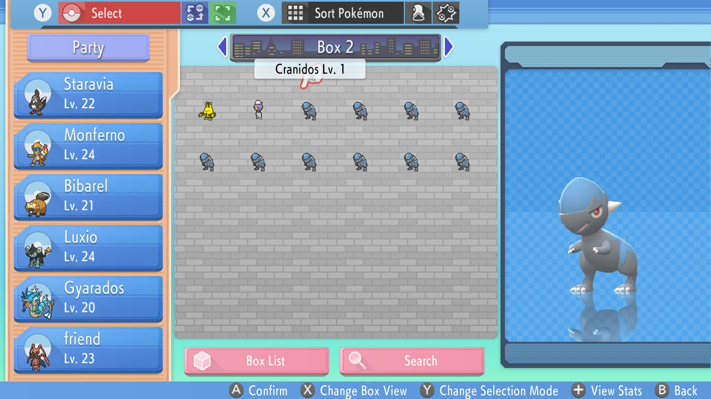

# **bdsp-fossil-automator**
## **Purpose**
A script that creates a macro for NXBT controllers to automate Shiny fossil hunting in Pokémon Brilliant Diamond/Shining Pearl. Allows speed-up of process without reliance on capture cards, microcontrollers, complex programs, or external hardware. I personally like to watch movies while I shiny hunt, so I let this run and that way I only have to check at the end of the loop instead of keeping constant eyes on it.

## **In Action and Use Case**

<p align="center">
    <sub>
    Figure 1: The starting position the macro should be run at.
    </sub>
</p>



<p align="center">
    <sub>
    Figure 2: A 10-fossil macro wielding 10 Cranidos in the next available Box.
    </sub>
</p>

<p align="center">
    
    </br>
    <sub>
    Figure 3: A gif of the macro working on a 5-fossil run.
    </sub>
</p>

## **Dependencies**
The script generator itself does not require any dependencies to run. However, the macro is made for [NXBT](https://github.com/Brikwerk/nxbt). Installation and usage instructions can be found there. I found success with this [$10 bluetooth adapter on Amazon](https://www.amazon.com/Sabrent-Bluetooth-Adapter-Technology-BT-UB40/dp/B06XHY5VXF), as other NXBT users recommended.

## **Instructions**
Run macro_generator.py and follow the prompts. The resulting text file writes to bdsp_macro.txt. You can either copy the contents and paste them into the NXBT webapp or you can read the file in with the NXBT CLI.

**The macro is made for a few specific settings - Sound Effects and Pokemon Cries set to 0, Text Speed set to Fast, and Send to Boxes set to Automatic**. This **drastically** speeds up the process and makes the most sense for a macro to run on. **It also requires you to start directly OUTSIDE of the Museum in Orebourgh City, as show in the photos above.** After this is done, you can check your desired box to see if they are shiny.

## **Warning**
NXBT, while a really cool program, seems to have issues with macro latency and sometimes connectivity issues. I find that my loop of 10 fossils (Roughly 4 minutes long) sometimes gets caught up after dropping off the 9th fossil. It works perfectly on 1-8 fossils at the moment. After each run for me, the controller normally disconnects so I press **reconnect controller** on the webapp when I am ready and then run the macro immediately after. Currently investigating if ~4m is the limit overall for just for my hardware or if this is a problem with the macro itself.

Because of the instability I've experienced, I've removed the part of the macro that starts from the main Switch menu and launches the title. It has drastically reduced the amount of problems I've had as it waits for ~30s. I also **highly recommend NOT to use the 'check box' option as if the inputs get messed up due to NXBT or your hardware's instability IT MAY PRESS R AND LOAD UP YOUR SAVE MENU PREMATURELY**. I am looking into this issue and may just remove it entirely to limit any trouble this could cause if someone isn't looking at their Switch.

## **Troubleshooting**
I ran into a handful of errors getting this up and running with NXBT. There are some useful threads in the NXBT issues threads, but I will compile what worked best for me here.

**Bluetooth USB Adapter not being recognized inside of vagrant ssh with 'lsusb'**

I had to go into Oracle VM Virtualbox and remove all USB passthroughs. Then, when I was ssh'ed in the vagrant VM, I would take the adapter out, type `lsusb`, plug the adapter back in, and then wait a minute and type `lsusb`. The VM needed to claim the USB adapter for itself and only worked when I replugged it while I was ssh'ed in the VM.

**Bluetooth USB Adapter being recognized, but not being "pairable" when using `sudo bluetoothctl`**

This problem frustrated me the most. My solution was to use a popular fork of NXBT from piratasdoraio [here](https://github.com/piratasdoraio/nxbt). This version, along with some ssh commands to ensure everything was enabled, works great for me. Once I launch up the VM and ssh into it, I follow these steps:
```
sudo passwd root 
```
This is just to allow us to run modprobe. After the first time it shouldn't ask again.
```
sudo modprobe btusb 
sudo systemctl enable bluetooth
sudo systemctl start bluetooth
sudo bluetoothctl
```
If you get the the pairable message that looks something like 
```
[---] Controller XX:XX:XX:XX:XX:XX Pairable: yes
```
Then you're good to go. Run 
```
sudo nxbt webapp
```
and then you can get to work with your macro.

## **Help/Additions**
If you require any help or have any ideas/find any bugs/want to push something, either make an issue or a PR!